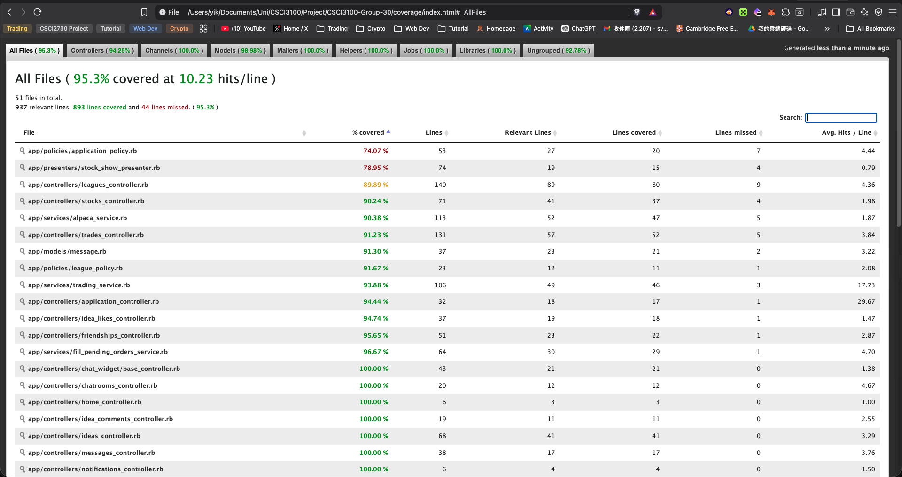

# Mock Fund League

A stock trading league simulation platform where users create leagues, trade virtual stocks, and compete on portfolio performance. Built for CSCI3100 (Software Engineering) — Option C.

## Table of Contents

- [Mock Fund League](#mock-fund-league)
  - [Table of Contents](#table-of-contents)
  - [Tech Stack](#tech-stack)
  - [Prerequisites](#prerequisites)
  - [Setup Guide](#setup-guide)
  - [Running Tests](#running-tests)
  - [CI/CD](#cicd)
  - [Implemented Features](#implemented-features)
    - [1. User Authentication and Social](#1-user-authentication-and-social)
    - [2. League Management](#2-league-management)
    - [3. Stock Market and Trading](#3-stock-market-and-trading)
    - [4. Community Ideas](#4-community-ideas)
  - [Feature Ownership](#feature-ownership)
  - [Test Coverage](#test-coverage)

## Tech Stack

| Layer | Technology |
| ------- | ----------- |
| Framework | Ruby on Rails 8.1.3 (Ruby 3.4.7) |
| Database | SQLite (dev/test), PostgreSQL (prod) |
| Frontend | Hotwire (Turbo + Stimulus), Bootstrap 5, Tailwind CSS |
| Asset Pipeline | Propshaft + Importmap |
| Authentication | Devise 5.0 |
| Authorization | Pundit 2.5 |
| Background Jobs | Solid Queue |
| Real-time | Action Cable |
| Rich Text | Action Text (Trix editor) |
| Testing | RSpec, Cucumber, FactoryBot, SimpleCov |
| CI/CD | GitHub Actions |

## Prerequisites

- Ruby 3.4.7
- Node.js and Yarn
- SQLite 3
- libvips (for image processing)

## Setup Guide

```bash
# 1. Clone the repository
git clone https://github.com/SYikRicky/CSCI3100-Group-30.git
cd CSCI3100-Group-30

# 2. Install dependencies
bundle install
yarn install

# 3. Set up the database
bin/rails db:create db:migrate db:seed

# 4. Start the development server
bin/dev
```

The app will be available at `http://localhost:3000`.

## Running Tests

```bash
# Run all RSpec tests
bundle exec rspec

# Run a single spec file
bundle exec rspec spec/models/user_spec.rb

# Run all Cucumber acceptance tests
bundle exec cucumber

# Run a single feature file
bundle exec cucumber features/auth.feature

# Lint and security scans
bin/rubocop            # code style
bin/brakeman --no-pager # security vulnerabilities
bin/bundler-audit       # gem vulnerabilities
bin/importmap audit     # JS dependency audit
```

## CI/CD

GitHub Actions runs 5 jobs on every push and pull request:

| Job | Description |
| ----- | ------------- |
| `scan_ruby` | Brakeman static analysis + Bundler Audit |
| `scan_js` | Importmap dependency audit |
| `lint` | RuboCop (Rails Omakase style) |
| `test` | RSpec unit and integration tests |
| `system-test` | Cucumber acceptance tests |

## Implemented Features

### 1. User Authentication and Social

- **Sign up / Sign in / Sign out** via Devise with email and display name
- **Friendships** — send, accept, and reject friend requests (bidirectional)
- **Direct Messaging** — real-time chat between accepted friends via Action Cable
- **Notifications** — system, invitation, and portfolio summary notifications with read/unread tracking

### 2. League Management

- **Create leagues** with custom name, starting capital, start/end dates, and auto-generated invite code
- **Join leagues** via invite code
- **League status** derived from dates: upcoming, active, passed
- **Leaderboard** — members ranked by portfolio total value

### 3. Stock Market and Trading

- **Stock browser** with live price display and OHLCV chart data
- **Market orders** — instant buy/sell at current price
- **Limit and Stop orders** — pending orders auto-filled when price conditions are met (`FillPendingOrdersService`)
- **Short selling** — open short positions and cover them
- **Take-Profit / Stop-Loss** — automatic position closing at target prices (`CheckTpSlService`)
- **Portfolio valuation** — tracks cash, holdings, and total value over time (`PortfolioValuationService`)
- **Price simulation** — Geometric Brownian Motion price progression (`AdvancePriceJob`)
- **Historical data** — seeded from Alpaca Markets API (`AlpacaService`, `HistoricalDataSeedJob`)

### 4. Community Ideas

- **Publish trading ideas** with rich text editor (Action Text with image support), stock ticker, direction (Long/Short/Neutral), and tags
- **Browse ideas feed** — sort by most recent or most popular, filter by stock or tag
- **Like / Unlike** ideas
- **Comment** on ideas with threaded replies
- **View count** tracking

## Feature Ownership

| Feature Name | Primary Developer | Secondary Developer | Notes |
| --- | --- | --- | --- |
| User Auth & Profiles | Sin Yik | Zhuang Cho Leong | Devise + Pundit |
| League Management | Zhuang Cho Leong | Sin Yik | Invite codes, leaderboard |
| Stock Trading Engine | Ni King Yiu | Sin Yik | Market/Limit/Stop orders, TradingService |
| Short Selling | Ni King Yiu | Leung Po Lai | Bidirectional holdings |
| Take-Profit / Stop-Loss | Leung Po Lai | Ni King Yiu | CheckTpSlService + FillPendingOrdersService |
| Price Simulation | Ni King Yiu | Zhuang Cho Leong | GBM-based AdvancePriceJob |
| Stock Charts (OHLCV) | Zhuang Cho Leong | Ni King Yiu | Historical data from Alpaca API |
| Friendships | Ng Yat Hong | Sin Yik | Bidirectional friend requests |
| Direct Messaging / Chatroom | Ng Yat Hong | Leung Po Lai | Action Cable real-time chat |
| Notifications | Leung Po Lai | Ng Yat Hong | System + invitation + portfolio |
| Community Ideas | Sin Yik | Zhuang Cho Leong | Action Text, likes, comments, tags |
| CI/CD & Testing | Sin Yik | Ng Yat Hong | GitHub Actions, RSpec + Cucumber |
| BDD/TDD Test Suite | Sin Yik | All members | RSpec + Cucumber |

## Test Coverage

<!-- Replace with your own SimpleCov screenshot -->

